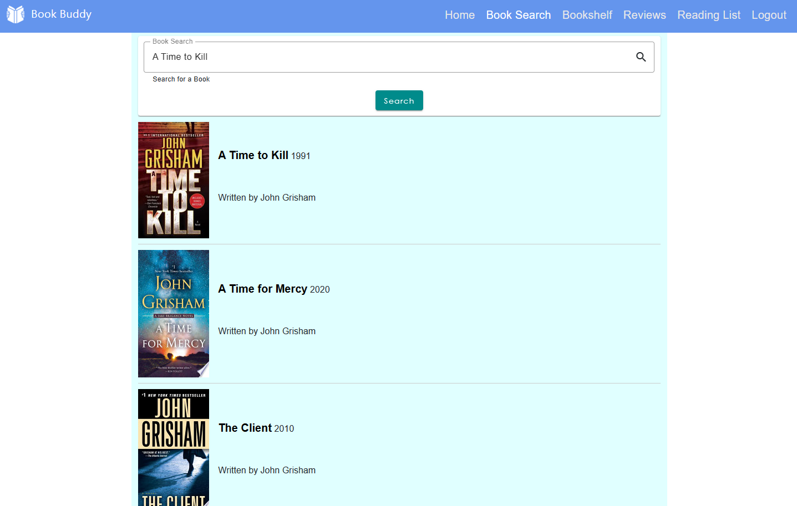
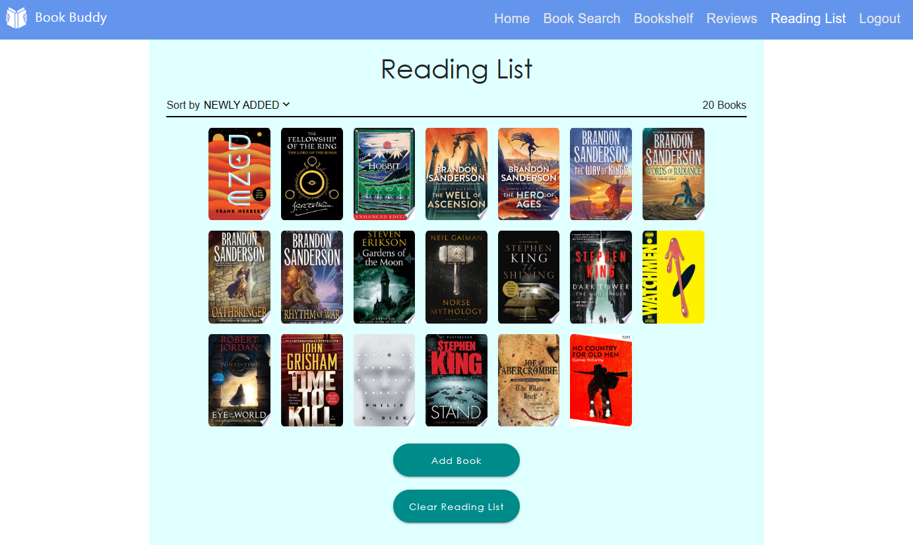

# BOOK BUDDY 
## A Personal Book Management and Review App Made Using Angular

Book Buddy is a book management application that was made using the Angular framework and uses the Google Books API to provide the user with a wide variety of books to explore. The Book Buddy application stores user information using an SQLite database. Using this app, users are able to:

* Search and explore numerous books

* View user ratings, descriptions, and other useful information about books they're interested in

* Add books that they want to read to their Reading List

* Create reviews and ratings for every book that they read

* Add books that they have read or that they own to their personal Bookshelf

## How to Use

1. Ensure that you have Node.js and npm installed on your device. You can download these from the Node.js website (https://nodejs.org/).

2. Click on the "Releases" section in this repository and download your desired release archive.

3. Once the download is complete, extract the contents of the release archive.

4. In a command prompt or terminal, open the folder with the name of the release archive in the folder where you extracted the release files.

5. In the command prompt or terminal, run the following command: `node setup.js`.

6. In your browser of choice, enter the following URL: http://localhost:4200/.